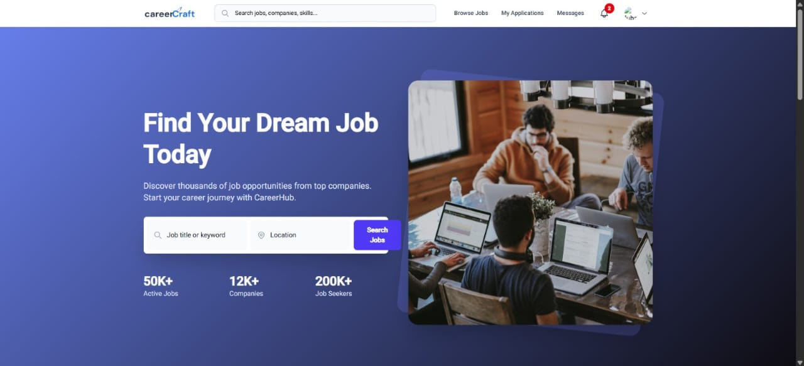
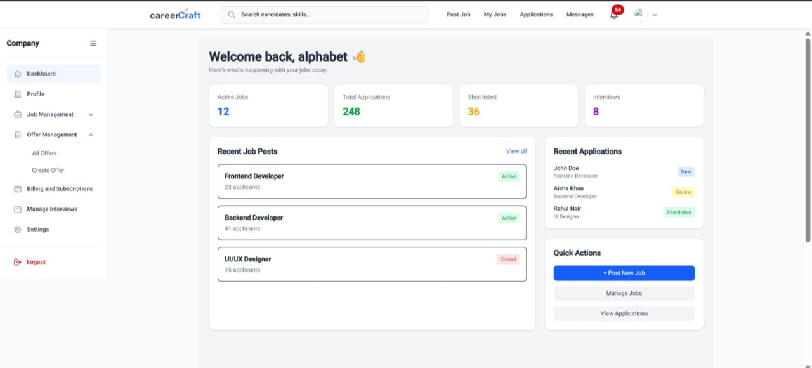
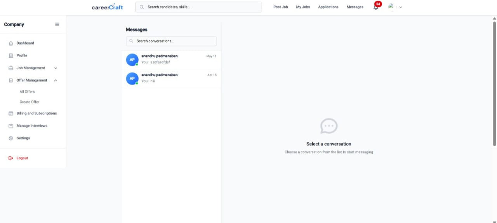
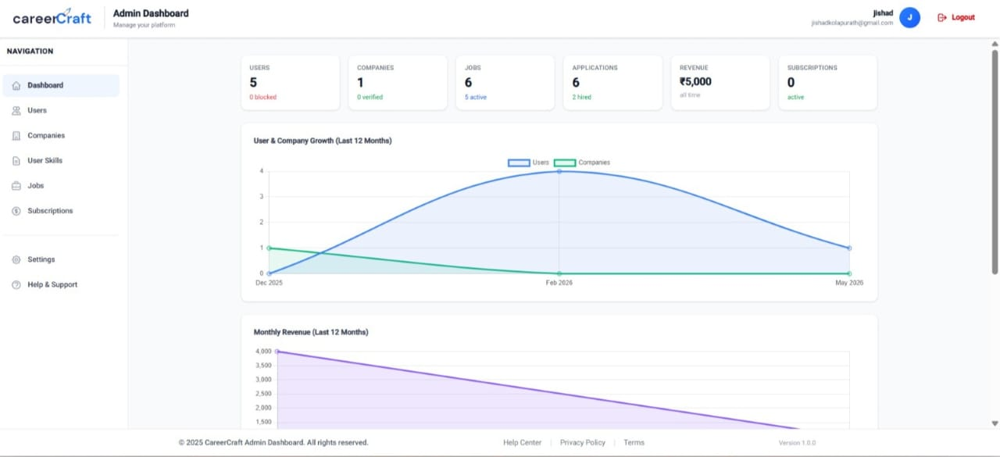
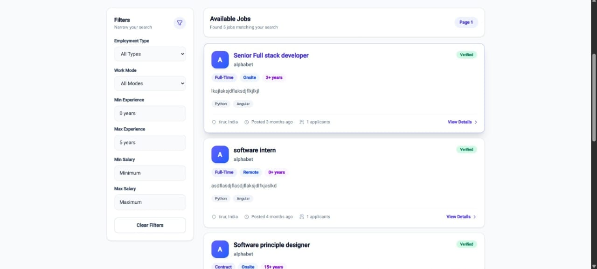
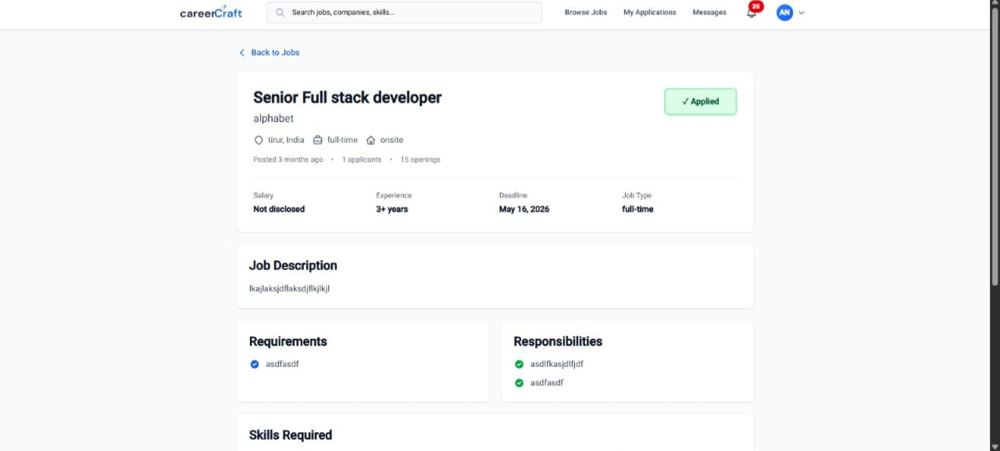

# CareerCraft

A full-stack job portal built with **Angular, Node.js, Express.js, TypeScript, and MongoDB**.

## Links

* [Live Demo](https://www.jishadkolapurath.online/home)
* [Frontend Repository](https://github.com/jishad1994/careerCraft-frontend)
* [Backend Repository](https://github.com/jishad1994/careerCraft-backend)

## Overview

CareerCraft is a full-stack job portal designed to connect job seekers and recruiters through a unified recruitment platform. The application supports job posting, job applications, recruiter management, real-time communication, video interviews, subscription management, and administrative operations.

## Key Features

* Multi-role authentication for Job Seekers, Recruiters, and Admins
* Job creation, search, filtering, and application management
* Recruiter dashboard for managing jobs and candidates
* Real-time chat using Socket.IO
* Video interviews
* Google OAuth authentication
* JWT-based authentication and authorization
* Role-based access control
* Recruiter subscription and payment management
* Admin dashboard and platform management
* Responsive Angular UI

## Tech Stack

### Frontend

* Angular
* TypeScript
* HTML5 / CSS3
* Tailwind CSS

### Backend

* Node.js
* Express.js
* TypeScript
* Socket.IO

### Database

* MongoDB
* Redis

### Authentication

* JWT
* Google OAuth 2.0

### DevOps & Deployment

* Docker
* AWS EC2
* Nginx
* GitHub Actions

## Screenshots

### Job Seeker Dashboard



### Recruiter Dashboard



### Real-Time Chat



### Admin Dashboard



### Job Listing Page



### Job Description Page



## API Documentation

The complete REST API documentation is available through Postman.

[View API Documentation](https://red-spaceship-249918.postman.co/workspace/Team-Workspace~57f670e0-a83b-432c-8177-23f6508be18b/collection/38828433-543c5651-18aa-4d44-8814-5c5b7517673a?action=share&source=copy-link&creator=38828433)

## Database Design

The database schema was designed using MongoDB and documented using an ER diagram.

[View Database Design](docs/images/database-design.png)

## Installation

### Frontend

```bash
git clone https://github.com/jishad1994/careerCraft-frontend
cd careerCraft-frontend
npm install
ng serve
```

### Backend

```bash
git clone https://github.com/jishad1994/careerCraft-backend
cd careerCraft-backend
npm install
npm run dev
```

> Before running the application, configure the required environment variables for the frontend and backend.

## Deployment

The backend application is deployed on an **AWS EC2 instance** using Docker containers. Redis is also containerized and runs alongside the backend application.

MongoDB is hosted on **MongoDB Atlas**, providing a cloud-based database accessible by the application.

Nginx is configured as a reverse proxy for the deployed application.

## Future Improvements

* AI-powered job application automation for candidates
* AI-based job recommendations based on user skills and search history
